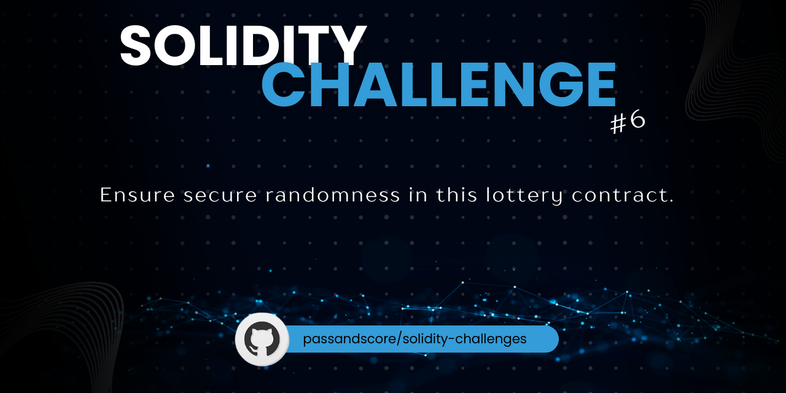

<<<<<<< HEAD

<p align="center">
  
</p>

# Challenge 06

## Problem Statement

Ensure secure randomness in this lottery contract.

**Task**:
- Using an outside source like a VRF, create a function in this contract that uses a secure randomness function.
- Provide your solution and comments in the discussion for this challenge.

**Constraints**:
- Use Solidity 0.8.x or higher.

**Author**: [codyrhoten](https://github.com/codyrhoten)

**Hints**: 
A mock VRF contract may be required as well as testing it on a testnet rather than Remix.
=======
## Foundry

**Foundry is a blazing fast, portable and modular toolkit for Ethereum application development written in Rust.**

Foundry consists of:

-   **Forge**: Ethereum testing framework (like Truffle, Hardhat and DappTools).
-   **Cast**: Swiss army knife for interacting with EVM smart contracts, sending transactions and getting chain data.
-   **Anvil**: Local Ethereum node, akin to Ganache, Hardhat Network.
-   **Chisel**: Fast, utilitarian, and verbose solidity REPL.

## Documentation

https://book.getfoundry.sh/

## Usage

### Build

```shell
$ forge build
```

### Test

```shell
$ forge test
```

### Format

```shell
$ forge fmt
```

### Gas Snapshots

```shell
$ forge snapshot
```

### Anvil

```shell
$ anvil
```

### Deploy

```shell
$ forge script script/Counter.s.sol:CounterScript --rpc-url <your_rpc_url> --private-key <your_private_key>
```

### Cast

```shell
$ cast <subcommand>
```

### Help

```shell
$ forge --help
$ anvil --help
$ cast --help
```
>>>>>>> 406c39c (chore: forge init)
